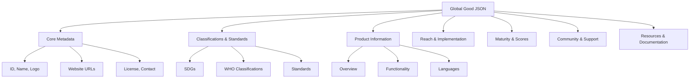

# How to Create a Global Good JSON File

## Table of Contents
1. [Overview](#overview)
2. [Quick Start Template](#quick-start-template)
3. [Field-by-Field Guide](#field-by-field-guide)
4. [Reference Data Codes](#reference-data-codes)
5. [Validation Rules](#validation-rules)
6. [Common Mistakes & Troubleshooting](#common-mistakes--troubleshooting)
7. [Best Practices](#best-practices)
8. [Review Checklist](#review-checklist)

---

## Overview

Global Good JSON files are the primary data format for storing detailed information about digital health and climate solutions in the Global Goods Guidebook. Each JSON file represents a single global good and contains structured information about its purpose, features, reach, maturity, and community support.

### File Location
- **Directory**: `/public/data/global-goods/individual/`
- **Naming Convention**: Use lowercase with hyphens (e.g., `dhis2.json`, `openmrs.json`, `climate-app.json`)
- **File Name MUST match the ID field** in the JSON

### Schema Structure Overview



---

## Quick Start Template

### Minimal Required Template
```json
{
  "ID": "your-global-good-id",
  "Name": "Your Global Good Name",
  "GlobalGoodsType": ["software"],
  "ProductOverview": {
    "Summary": "Brief one-line description of your global good",
    "Description": "Detailed description of what your global good does and its value proposition"
  }
}
```

### Complete Template
```json
{
  "ID": "example-global-good",
  "Name": "Example Global Good",
  "Logo": "/uploads/gg_logos/example-logo.png",
  "Website": {
    "main": {
      "url": "https://example.org",
      "description": "Official website"
    },
    "docs": {
      "url": "https://docs.example.org",
      "description": "Documentation"
    },
    "source_code": {
      "url": "https://github.com/example",
      "description": "Source code repository"
    },
    "demo": {
      "url": "https://demo.example.org",
      "description": "Live demo"
    }
  },
  "GlobalGoodsType": ["software"],
  "ClimateHealth": false,
  "License": "apache-2.0",
  "Contact": [
    {
      "name": "John Doe",
      "email": "john@example.org",
      "role": "Project Lead"
    }
  ],
  "Classifications": {
    "SDGs": ["SDG-3"],
    "WHO": ["WHO_A1"],
    "WMO": [],
    "DPI": ["DPI_BD1"]
  },
  "StandardsAndInteroperability": {
    "HealthStandards": ["ICD-10", "LOINC"],
    "Interoperability": ["FHIR", "HL7 V2"],
    "ClimateStandards": []
  },
  "ProductOverview": {
    "Summary": "One-line description",
    "Description": "Detailed description",
    "PrimaryFunctionality": "Core function",
    "Users": "Target users",
    "Languages": ["en", "fr", "es"],
    "Screenshots": [
      {
        "url": "/uploads/gg_screenshots/example1.png",
        "description": "Main dashboard"
      }
    ]
  },
  "Reach": {
    "SummaryOfReach": "Global deployment summary",
    "NumberOfImplementations": 100,
    "ImplementationCountries": ["ke", "ug", "tz"]
  },
  "Maturity": {
    "SummaryOfMaturity": "Maturity overview",
    "Scores": [
      {
        "year": 2025,
        "global_utility": 7,
        "community_support": 8,
        "maturity_of_gg": 7,
        "inclusive_design": 6,
        "climate_resilience": 5,
        "low_carbon": 6
      }
    ]
  },
  "Community": {
    "DescriptionOfCommunity": "Community description",
    "HostAnchorOrganization": {
      "name": "Organization Name",
      "url": "https://org.example",
      "description": "Organization description",
      "country": ["us"]
    },
    "InceptionYear": 2015,
    "SizeOfCommunity": 5000
  },
  "Resources": {
    "ProductDocumentation": [
      {
        "description": "User Guide",
        "url": "https://docs.example.org/user-guide"
      }
    ]
  },
  "LinkedInitiatives": {
    "Initiative": [
      {
        "collectionInitiative": "dpga",
        "tool_url": "https://digitalpublicgoods.net/registry/example.html"
      }
    ]
  }
}
```

---

## Field-by-Field Guide

### 1. Core Identification Fields

#### ID (Required)
- **Type**: String
- **Format**: Lowercase with hyphens
- **Example**: `"dhis2"`, `"openmrs"`, `"climate-tracker"`
- **Validation**: Must match filename, no spaces, alphanumeric + hyphens only
- **Common Mistakes**: Using spaces, uppercase letters, or underscores

#### Name (Required)
- **Type**: String
- **Format**: Proper case with spaces allowed
- **Example**: `"DHIS2"`, `"OpenMRS"`, `"Climate Health Tracker"`
- **Best Practice**: Use official product name as displayed on website

#### Logo (Optional)
- **Type**: String (URL path)
- **Format**: Relative path to image file
- **Example**: `"/uploads/gg_logos/dhis2-logo.png"`
- **Image Requirements**:
  - Format: PNG, JPG, or SVG
  - Size: Max 500KB
  - Dimensions: Recommended 400x200px
  - Location: Store in `/public/uploads/gg_logos/`

### 2. Website Information

#### Website (Optional but Recommended)
```json
"Website": {
  "main": {
    "url": "https://example.org",
    "description": "Official website"
  },
  "docs": {
    "url": "https://docs.example.org",
    "description": "User and developer documentation"
  },
  "source_code": {
    "url": "https://github.com/example",
    "description": "Main code repository"
  },
  "demo": {
    "url": "https://demo.example.org",
    "description": "Try it online"
  }
}
```
- **Validation**: URLs must be valid HTTP/HTTPS
- **Best Practice**: Include at least `main` and `source_code` for open source projects

### 3. Type and Licensing

#### GlobalGoodsType (Required)
- **Type**: Array of strings
- **Valid Values**: See `/public/data/reference/globalGoodsTypes.json`
  - `"software"`
  - `"content"`
  - `"standard"`
  - `"ai_model"`
- **Example**: `["software"]` or `["software", "standard"]`

#### License (Required for Software)
- **Type**: String
- **Valid Values**: See `/public/data/reference/licenses.json`
  - Common: `"apache-2.0"`, `"mit"`, `"gpl-3.0"`, `"bsd-3-clause"`
- **Example**: `"apache-2.0"`
- **Validation**: Must be a valid SPDX license identifier

#### Contact (Optional)
```json
"Contact": [
  {
    "name": "Jane Smith",
    "email": "jane@example.org",
    "role": "Technical Lead"
  }
]
```
- **Email Validation**: Must be valid email format
- **Best Practice**: Include at least one technical contact

### 4. Classifications

#### Classifications Object
```json
"Classifications": {
  "SDGs": ["SDG-3", "SDG-13"],
  "WHO": ["WHO_A1", "WHO_B2"],
  "WMO": ["WMO_A1"],
  "DPI": ["DPI_BD1"]
}
```

##### SDGs (Sustainable Development Goals)
- **Reference File**: `/public/data/reference/classifications/sdgs.json`
- **Format**: `SDG-[number]`
- **Common Values**:
  - `SDG-3`: Good Health and Well-being
  - `SDG-13`: Climate Action
  - `SDG-6`: Clean Water and Sanitation

##### WHO Classifications
- **Reference File**: `/public/data/reference/classifications/who.json`
- **Format**: `WHO_[letter][number]`
- **Categories**:
  - A: Health Records & Information Systems
  - B: Health Service Management
  - C: Laboratory & Diagnostics
  - D: Health Intelligence & Analytics
  - E: Public Health & Surveillance

##### WMO Classifications (Climate)
- **Reference File**: `/public/data/reference/classifications/wmo.json`
- **Format**: `WMO_[letter][number]`
- **Use for**: Climate-health integrated solutions

##### DPI Classifications
- **Reference File**: `/public/data/reference/classifications/dpi.json`
- **Format**: `DPI_[code]`
- **Examples**: `DPI_BD1`, `DPI_BD3`, `DPI_BD4`

### 5. Standards and Interoperability

```json
"StandardsAndInteroperability": {
  "HealthStandards": ["ICD-10", "ICD-11", "LOINC", "SNOMED-CT"],
  "Interoperability": ["FHIR", "HL7 V2", "ADX"],
  "ClimateStandards": ["CF", "WMO-BUFR"]
}
```

#### Health Standards
- **Reference File**: `/public/data/reference/standards/health.json`
- **Common Values**:
  - Terminology: `ICD-10`, `ICD-11`, `LOINC`, `SNOMED-CT`
  - Pharmacy: `RxNorm`, `ATC`
  - Imaging: `DICOM`

#### Interoperability Standards
- **Reference File**: `/public/data/reference/standards/interoperability.json`
- **Common Values**:
  - `FHIR`: Fast Healthcare Interoperability Resources
  - `HL7 V2`, `HL7 V3`: Health Level Seven
  - `ADX`: Aggregate Data Exchange
  - `OpenHIE`: Open Health Information Exchange

#### Climate Standards
- **Reference File**: `/public/data/reference/standards/climate.json`
- **Common Values**: `CF`, `WMO-BUFR`, `NetCDF`

### 6. Product Overview

```json
"ProductOverview": {
  "Summary": "Brief one-line description (max 150 characters)",
  "Description": "Detailed description (2-3 paragraphs)",
  "PrimaryFunctionality": "Core function in 1-2 sentences",
  "Users": "Comma-separated list of target users",
  "Languages": ["en", "fr", "es", "pt", "ar"],
  "Screenshots": [
    {
      "url": "/uploads/gg_screenshots/dashboard.png",
      "description": "Main analytics dashboard"
    }
  ]
}
```

#### Language Codes
- **Reference File**: `/public/data/reference/productLanguages.json`
- **Format**: ISO 639-1 codes
- **Common**: `en`, `fr`, `es`, `pt`, `ar`, `zh`, `hi`, `sw`

#### Screenshots
- **Location**: `/public/uploads/gg_screenshots/`
- **Format**: PNG or JPG
- **Size**: Max 2MB per image
- **Dimensions**: 1920x1080 recommended
- **Best Practice**: Include 2-4 screenshots showing key features

### 7. Reach and Implementation

```json
"Reach": {
  "SummaryOfReach": "Deployed in 25 countries across Africa and Asia",
  "NumberOfImplementations": 150,
  "ImplementationMapOverview": {
    "url": "https://example.org/implementations",
    "description": "Interactive implementation map"
  },
  "ImplementationCountries": ["ke", "ug", "tz", "rw", "et", "ng", "gh"]
}
```

#### Country Codes
- **Reference File**: `/public/data/reference/countries.json`
- **Format**: ISO 3166-1 alpha-2 lowercase
- **Examples**:
  - `ke`: Kenya
  - `ug`: Uganda
  - `tz`: Tanzania
  - `in`: India
  - `br`: Brazil
- **Validation Tool**: Check against countries.json

### 8. Maturity Scores

```json
"Maturity": {
  "SummaryOfMaturity": "Mature platform with 10+ years of development",
  "Scores": [
    {
      "year": 2025,
      "global_utility": 8,
      "community_support": 7,
      "maturity_of_gg": 9,
      "inclusive_design": 6,
      "climate_resilience": 5,
      "low_carbon": 6
    }
  ]
}
```

#### Score Metrics (1-10 scale)
- **global_utility**: How useful globally
- **community_support**: Strength of community
- **maturity_of_gg**: Technical maturity
- **inclusive_design**: Accessibility and inclusivity
- **climate_resilience**: Climate adaptation features
- **low_carbon**: Environmental efficiency

### 9. Community Information

```json
"Community": {
  "DescriptionOfCommunity": "Active global community with 5000+ members",
  "HostAnchorOrganization": {
    "name": "University of Oslo",
    "url": "https://www.uio.no",
    "description": "Academic host organization",
    "country": ["no"]
  },
  "InceptionYear": 2006,
  "SizeOfCommunity": 5000,
  "Links": {
    "Community": {
      "url": "https://community.example.org",
      "description": "Community forum"
    }
  },
  "Events": {
    "description": "Annual conferences and monthly webinars",
    "schedule": "https://example.org/events"
  },
  "Policies": {
    "Governance": {
      "url": "https://example.org/governance",
      "description": "Governance model"
    },
    "TermsOfUse": {
      "url": "https://example.org/terms",
      "description": "Terms of use"
    },
    "PrivacyPolicy": {
      "url": "https://example.org/privacy",
      "description": "Privacy policy"
    }
  }
}
```

### 10. Resources and Documentation

```json
"Resources": {
  "Articles": [
    {
      "description": "Implementation case study",
      "url": "https://example.org/case-study"
    }
  ],
  "ProductDocumentation": [
    {
      "description": "Complete product guide",
      "url": "https://docs.example.org"
    }
  ],
  "UserRequirements": [
    {
      "description": "System requirements",
      "url": "https://docs.example.org/requirements"
    }
  ],
  "EndUserDocumentation": [
    {
      "description": "User manual",
      "url": "https://docs.example.org/user-guide"
    }
  ],
  "DeveloperDocumentation": [
    {
      "description": "API documentation",
      "url": "https://docs.example.org/api"
    }
  ]
}
```

### 11. Linked Initiatives

```json
"LinkedInitiatives": {
  "Initiative": [
    {
      "collectionInitiative": "dpga",
      "tool_url": "https://digitalpublicgoods.net/registry/example.html"
    },
    {
      "collectionInitiative": "dial-exchange",
      "tool_url": "https://exchange.dial.global/products/example"
    }
  ]
}
```

#### Valid Collection Initiatives
- **Reference File**: `/public/data/reference/collectionInitiatives.json`
- Common values:
  - `dpga`: Digital Public Goods Alliance
  - `dial-exchange`: DIAL Exchange
  - `who-smart`: WHO SMART Guidelines

---

## Reference Data Codes

### Finding the Right Codes

1. **SDG Codes**: Check `/public/data/reference/classifications/sdgs.json`
   - Look for goals relevant to your product
   - Most health products use SDG-3
   - Climate products often use SDG-13

2. **WHO Classifications**: Check `/public/data/reference/classifications/who.json`
   - Review the description for each code
   - Match functionality to appropriate categories

3. **Standards**: Check `/public/data/reference/standards/`
   - health.json for medical standards
   - interoperability.json for data exchange
   - climate.json for weather/climate data

4. **Country Codes**: Check `/public/data/reference/countries.json`
   - Use ISO 3166-1 alpha-2 codes in lowercase
   - Verify country names match official listings

5. **License Codes**: Check `/public/data/reference/licenses.json`
   - Use SPDX identifiers
   - Must match exactly (case-sensitive)

---

## Validation Rules

### Required Fields
- ✅ `ID` - Must match filename
- ✅ `Name` - Product name
- ✅ `GlobalGoodsType` - At least one type
- ✅ `ProductOverview.Summary` - Brief description
- ✅ `ProductOverview.Description` - Detailed description

### Format Validation
- **URLs**: Must start with `http://` or `https://`
- **Emails**: Must be valid email format
- **Years**: Must be 4-digit numbers
- **Scores**: Must be integers 1-10
- **Country Codes**: Must exist in countries.json
- **Language Codes**: Must be valid ISO 639-1

### Content Guidelines
- **Summary**: Maximum 150 characters
- **Description**: 100-500 words recommended
- **Screenshots**: 2-4 images recommended
- **Contact**: At least one contact recommended

---

## Common Mistakes & Troubleshooting

### ❌ Common Errors and ✅ Solutions

#### 1. ID Mismatch
- ❌ **Error**: File named `OpenMRS.json` with ID `"openmrs"`
- ✅ **Solution**: Rename file to `openmrs.json` (lowercase)

#### 2. Invalid Country Codes
- ❌ **Error**: Using `"USA"` or `"United States"`
- ✅ **Solution**: Use `"us"` (ISO 3166-1 alpha-2 lowercase)

#### 3. Wrong License Format
- ❌ **Error**: `"License": "Apache 2.0"`
- ✅ **Solution**: `"License": "apache-2.0"` (SPDX identifier)

#### 4. Missing Required Fields
- ❌ **Error**: No ProductOverview section
- ✅ **Solution**: Add at minimum Summary and Description

#### 5. Invalid Classification Codes
- ❌ **Error**: `"SDGs": ["Goal 3"]`
- ✅ **Solution**: `"SDGs": ["SDG-3"]`

#### 6. Broken Image Paths
- ❌ **Error**: `"Logo": "logo.png"`
- ✅ **Solution**: `"Logo": "/uploads/gg_logos/logo.png"`

#### 7. Array vs String Confusion
- ❌ **Error**: `"GlobalGoodsType": "software"`
- ✅ **Solution**: `"GlobalGoodsType": ["software"]`

#### 8. Invalid JSON Syntax
- ❌ **Error**: Missing commas, quotes, or brackets
- ✅ **Solution**: Validate with JSON validator

#### 9. Incorrect Score Values
- ❌ **Error**: `"global_utility": "high"` or `"global_utility": 15`
- ✅ **Solution**: `"global_utility": 8` (integer 1-10)

#### 10. Mixed Language Codes
- ❌ **Error**: `"Languages": ["English", "fr", "Spanish"]`
- ✅ **Solution**: `"Languages": ["en", "fr", "es"]`

---

## Best Practices

### Content Writing
1. **Be Concise**: Summary should be scannable
2. **Be Specific**: Avoid vague descriptions
3. **Use Active Voice**: "Manages patient records" not "Patient records are managed"
4. **Include Numbers**: "Used in 45 countries" is better than "widely used"
5. **Update Regularly**: Review quarterly, update annually

### Image Guidelines
1. **Logo**: Use transparent PNG or SVG when possible
2. **Screenshots**: Show actual interface, not mockups
3. **File Naming**: Use descriptive names like `dashboard-analytics.png`
4. **Compression**: Optimize images for web (use tools like TinyPNG)

### Data Quality
1. **Verify URLs**: Test all links before submission
2. **Check References**: Ensure classification codes exist
3. **Validate JSON**: Use a JSON validator before saving
4. **Cross-Reference**: Check similar products for consistency
5. **Document Sources**: Keep notes on data sources

### Naming Conventions
1. **File Names**: lowercase-with-hyphens.json
2. **IDs**: Match filename without extension
3. **URLs**: Use HTTPS when available
4. **Paths**: Use absolute paths starting with `/`

---

## Review Checklist

### Before Submitting Your Global Good JSON

#### ✅ Required Fields
- [ ] ID field matches filename
- [ ] Name field is present
- [ ] GlobalGoodsType array has at least one value
- [ ] ProductOverview.Summary exists
- [ ] ProductOverview.Description exists

#### ✅ Data Validation
- [ ] All URLs are valid and working
- [ ] Email addresses are properly formatted
- [ ] Country codes exist in countries.json
- [ ] Classification codes are valid
- [ ] License code is valid SPDX identifier
- [ ] Language codes are ISO 639-1
- [ ] Maturity scores are integers 1-10
- [ ] JSON syntax is valid (no parsing errors)

#### ✅ Content Quality
- [ ] Summary is under 150 characters
- [ ] Description clearly explains value proposition
- [ ] Target users are identified
- [ ] At least one website URL provided
- [ ] Logo path is correct (if provided)
- [ ] Screenshots show actual product (if provided)

#### ✅ Best Practices
- [ ] Similar products reviewed for consistency
- [ ] All external links tested
- [ ] Images optimized for web
- [ ] Contact information verified
- [ ] Recent maturity scores included (current year)
- [ ] Implementation countries verified

#### ✅ Documentation
- [ ] At least one documentation link provided
- [ ] Source code repository linked (if open source)
- [ ] Community links included (if applicable)
- [ ] Initiative links verified (DPGA, DIAL, etc.)

---

## Need Help?

- **Reference Data**: Check `/public/data/reference/` directory
- **Examples**: Review well-structured files like `dhis2.json`, `openmrs.json`
- **Validation**: Use online JSON validators
- **Schema**: See `/src/lib/types/globalGoodFlat.ts` for TypeScript interface

---

## Quick Reference Tables

### Classification Quick Lookup

| Type | Format | Example | Reference File |
|------|--------|---------|---------------|
| SDG | SDG-[number] | SDG-3 | `/public/data/reference/classifications/sdgs.json` |
| WHO | WHO_[letter][number] | WHO_A1 | `/public/data/reference/classifications/who.json` |
| WMO | WMO_[letter][number] | WMO_A1 | `/public/data/reference/classifications/wmo.json` |
| DPI | DPI_[code] | DPI_BD1 | `/public/data/reference/classifications/dpi.json` |

### Common Standards

| Category | Common Values |
|----------|--------------|
| Health Terminology | ICD-10, ICD-11, LOINC, SNOMED-CT |
| Interoperability | FHIR, HL7 V2, HL7 V3, ADX, OpenHIE |
| Climate | CF, WMO-BUFR, NetCDF |
| Pharmacy | RxNorm, ATC |

### License Codes

| License | Code |
|---------|------|
| Apache 2.0 | apache-2.0 |
| MIT | mit |
| GPL 3.0 | gpl-3.0 |
| BSD 3-Clause | bsd-3-clause |
| Mozilla Public 2.0 | mpl-2.0 |

---

*Last Updated: 2025*