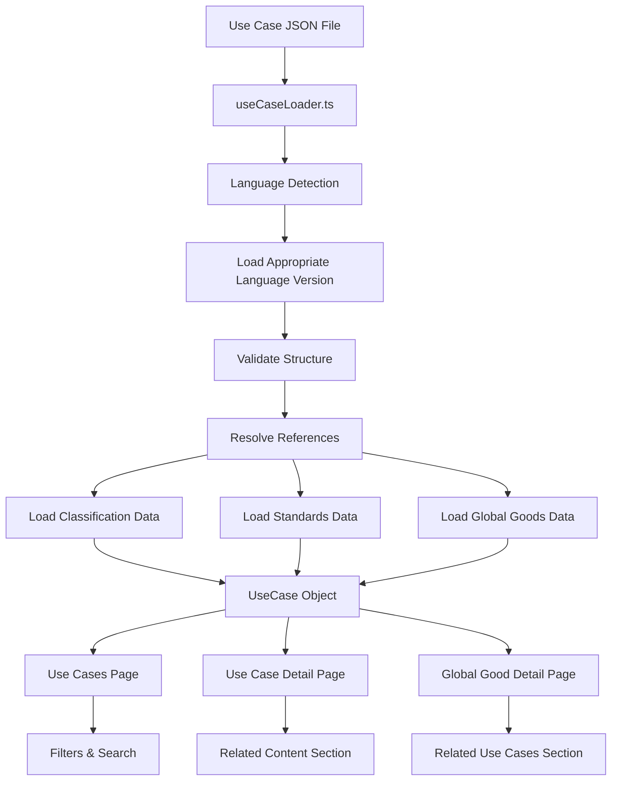
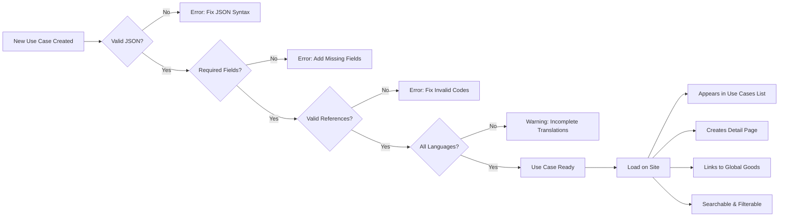

# Use Case JSON Creation Guide

## Overview

Use cases in the Global Goods Atlas demonstrate real-world applications of digital global goods in health and climate contexts. Each use case is a structured JSON document that describes actors, workflows, data requirements, and outcomes.

### Key Information

- **File Location**: `/src/data/use-cases/`
- **File Format**: JSON with multilingual structure
- **Naming Convention**: Lowercase with hyphens (e.g., `senegal-heat-alert.json`)
- **Languages Supported**: English (en), French (fr), Spanish (es)
- **Feature Flag**: Must be enabled in `src/globalgoodsconfig.json`

## Quick Start Templates

### Minimal Required Template

```json
{
  "en": {
    "id": "your-use-case-id",
    "title": "Your Use Case Title",
    "purpose": "Brief description of the use case purpose and the problem it solves",
    "classifications": {},
    "scope": "What is included and excluded from this use case",
    "actors": "Key stakeholders and their roles",
    "preconditions": "Prerequisites that must be in place",
    "process_steps": "Step-by-step workflow",
    "postconditions": "Expected outcomes and results",
    "data_requirements": "Data needed for implementation",
    "standards": [],
    "technology_components": "",
    "global_goods": [],
    "challenges": "",
    "sustainability_considerations": ""
  },
  "fr": {
    "id": "your-use-case-id",
    "title": "[French translation]",
    "purpose": "[French translation]",
    "classifications": {},
    "scope": "[French translation]",
    "actors": "[French translation]",
    "preconditions": "[French translation]",
    "process_steps": "[French translation]",
    "postconditions": "[French translation]",
    "data_requirements": "[French translation]",
    "standards": [],
    "technology_components": "[French translation]",
    "global_goods": [],
    "challenges": "[French translation]",
    "sustainability_considerations": "[French translation]"
  },
  "es": {
    "id": "your-use-case-id",
    "title": "[Spanish translation]",
    "purpose": "[Spanish translation]",
    "classifications": {},
    "scope": "[Spanish translation]",
    "actors": "[Spanish translation]",
    "preconditions": "[Spanish translation]",
    "process_steps": "[Spanish translation]",
    "postconditions": "[Spanish translation]",
    "data_requirements": "[Spanish translation]",
    "standards": [],
    "technology_components": "[Spanish translation]",
    "global_goods": [],
    "challenges": "[Spanish translation]",
    "sustainability_considerations": "[Spanish translation]"
  }
}
```

### Complete Example Template

```json
{
  "en": {
    "id": "climate-health-surveillance",
    "title": "Integrated Climate and Health Surveillance System",
    "purpose": "Enable early detection and response to climate-sensitive health threats through integrated data systems that combine meteorological data with disease surveillance.",
    "classifications": {
      "sdg": "SDG-3",
      "who_system": "WHO_A2",
      "wmo_category": "WMO_D1"
    },
    "scope": "**Included:**\n- Real-time weather monitoring\n- Disease surveillance integration\n- Early warning systems\n- Response coordination\n\n**Excluded:**\n- Clinical treatment protocols\n- Laboratory diagnostic procedures",
    "actors": "- **Ministry of Health**: Disease surveillance and response coordination\n- **National Meteorological Service**: Weather data provision\n- **WHO Regional Office**: Technical guidance and quality assurance\n- **Health Facilities**: Case reporting and outbreak response\n- **Community Health Workers**: Field data collection and awareness",
    "preconditions": "- Functional DHIS2 instance for health data\n- Access to meteorological data feeds\n- Trained staff in both health and climate sectors\n- Established data sharing agreements\n- Internet connectivity at key facilities",
    "process_steps": "1. **Data Collection**: Weather stations and health facilities collect daily data\n2. **Data Integration**: DHIS2 aggregates health data with weather parameters\n3. **Analysis**: Automated algorithms detect anomalies and trends\n4. **Alert Generation**: System generates alerts based on predefined thresholds\n5. **Notification**: Alerts distributed to relevant stakeholders via SMS/email\n6. **Response**: Health teams implement preparedness measures\n7. **Monitoring**: Track response effectiveness and adjust as needed",
    "postconditions": "- Timely detection of climate-health risks\n- Coordinated multi-sectoral response\n- Reduced morbidity and mortality from climate-sensitive diseases\n- Enhanced preparedness capacity\n- Data available for trend analysis and planning",
    "data_requirements": "**Health Data:**\n- Daily disease case reports (malaria, diarrhea, respiratory infections)\n- Geographic location of cases\n- Patient demographics\n\n**Climate Data:**\n- Temperature (min, max, average)\n- Precipitation\n- Humidity\n- Wind patterns\n\n**Infrastructure Data:**\n- Health facility locations\n- Population distribution\n- Water sources",
    "standards": ["FHIR", "ADX", "WMO_WIGOS", "WMO_WIS"],
    "technology_components": "- **DHIS2**: Core health information system\n- **OpenHexa**: Data pipeline and analysis\n- **SORMAS**: Outbreak management\n- **SMS Gateway**: Alert notifications\n- **Weather API**: Real-time meteorological data access",
    "global_goods": [
      {
        "id": "dhis2",
        "name": "DHIS2",
        "url": "/global-goods/dhis2"
      },
      {
        "id": "openhexa",
        "name": "OpenHexa",
        "url": "/global-goods/openhexa"
      },
      {
        "id": "sormas",
        "name": "SORMAS",
        "url": "/global-goods/sormas"
      }
    ],
    "challenges": "- **Data Integration**: Different formats and standards between health and climate sectors\n- **Connectivity**: Limited internet access in remote areas affects real-time monitoring\n- **Capacity**: Staff require training in both health and climate data interpretation\n- **Sustainability**: Ongoing costs for data infrastructure and maintenance\n- **Coordination**: Ensuring effective collaboration between ministries",
    "sustainability_considerations": "- **Local Ownership**: National institutions lead implementation and maintenance\n- **Open Source**: All software components use open-source global goods\n- **Capacity Building**: Regular training programs for staff retention\n- **Government Budget**: Integration into national health and climate budgets\n- **Regional Collaboration**: Shared resources and expertise across countries"
  },
  "fr": {
    "id": "climate-health-surveillance",
    "title": "Système intégré de surveillance climatique et sanitaire",
    "purpose": "[French translation of purpose]",
    "classifications": {
      "sdg": "ODD-3",
      "who_system": "WHO_A2",
      "wmo_category": "WMO_D1"
    },
    "scope": "[French translation of scope]",
    "actors": "[French translation of actors]",
    "preconditions": "[French translation of preconditions]",
    "process_steps": "[French translation of process_steps]",
    "postconditions": "[French translation of postconditions]",
    "data_requirements": "[French translation of data_requirements]",
    "standards": ["FHIR", "ADX", "WMO_WIGOS", "WMO_WIS"],
    "technology_components": "[French translation of technology_components]",
    "global_goods": [
      {
        "id": "dhis2",
        "name": "DHIS2",
        "url": "/global-goods/dhis2"
      },
      {
        "id": "openhexa",
        "name": "OpenHexa",
        "url": "/global-goods/openhexa"
      },
      {
        "id": "sormas",
        "name": "SORMAS",
        "url": "/global-goods/sormas"
      }
    ],
    "challenges": "[French translation of challenges]",
    "sustainability_considerations": "[French translation of sustainability_considerations]"
  },
  "es": {
    "id": "climate-health-surveillance",
    "title": "Sistema integrado de vigilancia climática y sanitaria",
    "purpose": "[Spanish translation of purpose]",
    "classifications": {
      "sdg": "ODS-3",
      "who_system": "WHO_A2",
      "wmo_category": "WMO_D1"
    },
    "scope": "[Spanish translation of scope]",
    "actors": "[Spanish translation of actors]",
    "preconditions": "[Spanish translation of preconditions]",
    "process_steps": "[Spanish translation of process_steps]",
    "postconditions": "[Spanish translation of postconditions]",
    "data_requirements": "[Spanish translation of data_requirements]",
    "standards": ["FHIR", "ADX", "WMO_WIGOS", "WMO_WIS"],
    "technology_components": "[Spanish translation of technology_components]",
    "global_goods": [
      {
        "id": "dhis2",
        "name": "DHIS2",
        "url": "/global-goods/dhis2"
      },
      {
        "id": "openhexa",
        "name": "OpenHexa",
        "url": "/global-goods/openhexa"
      },
      {
        "id": "sormas",
        "name": "SORMAS",
        "url": "/global-goods/sormas"
      }
    ],
    "challenges": "[Spanish translation of challenges]",
    "sustainability_considerations": "[Spanish translation of sustainability_considerations]"
  }
}
```

## Field-by-Field Reference

### Core Identification

#### id (Required)
- **Type**: String
- **Description**: Unique identifier for the use case
- **Rules**: 
  - Must match the filename (without `.json` extension)
  - Lowercase letters, numbers, and hyphens only
  - No spaces or special characters
  - Same across all language versions
- **Example**: `"climate-health-surveillance"`

#### title (Required)
- **Type**: String
- **Description**: Descriptive title of the use case
- **Rules**: 
  - Clear and concise (ideally under 60 characters)
  - Translated for each language
  - Should indicate the domain and purpose
- **Example**: `"Integrated Climate and Health Surveillance System"`

#### purpose (Required)
- **Type**: String (Markdown supported)
- **Description**: Why this use case exists and what problem it solves
- **Rules**: 
  - 1-3 sentences explaining the core value proposition
  - Should answer: "What problem does this solve?"
  - Translated for each language
- **Example**: `"Enable early detection and response to climate-sensitive health threats through integrated data systems..."`

### Classifications (Optional but Recommended)

#### classifications.sdg
- **Type**: String
- **Description**: Sustainable Development Goal alignment
- **Reference**: `/public/data/reference/classifications/sdgs.json`
- **Format**: 
  - English: `"SDG-3"`, `"SDG-13"`
  - French: `"ODD-3"`, `"ODD-13"`
  - Spanish: `"ODS-3"`, `"ODS-13"`
- **Common Values**:
  - `SDG-3`: Good Health and Well-being
  - `SDG-13`: Climate Action
  - `SDG-17`: Partnerships for the Goals

#### classifications.who_system
- **Type**: String
- **Description**: WHO building block classification
- **Reference**: `/public/data/reference/classifications/who.json`
- **Format**: `"WHO_A2"`, `"WHO_B1"`, etc.
- **Common Values**:
  - `WHO_A2`: Health information systems
  - `WHO_A3`: Medical products and technologies
  - `WHO_B1`: Service delivery

#### classifications.wmo_category
- **Type**: String
- **Description**: WMO climate service category
- **Reference**: `/public/data/reference/classifications/wmo.json`
- **Format**: `"WMO_D1"`, `"WMO_D2"`, etc.
- **Common Values**:
  - `WMO_D1`: Health
  - `WMO_D2`: Agriculture and Food Security
  - `WMO_D3`: Water Resources

### Workflow Description

#### scope (Required)
- **Type**: String (Markdown supported)
- **Description**: What is included and excluded from this use case
- **Best Practice**: Use headings for "Included" and "Excluded" with bullet lists
- **Example**:
```markdown
**Included:**
- Real-time weather monitoring
- Disease surveillance integration

**Excluded:**
- Clinical treatment protocols
- Laboratory diagnostic procedures
```

#### actors (Required)
- **Type**: String (Markdown supported)
- **Description**: Key stakeholders and their roles
- **Best Practice**: Use bullet list with bold actor names followed by role description
- **Example**:
```markdown
- **Ministry of Health**: Disease surveillance and response coordination
- **National Meteorological Service**: Weather data provision
- **WHO Regional Office**: Technical guidance
```

#### preconditions (Required)
- **Type**: String (Markdown supported)
- **Description**: Prerequisites that must be in place before implementation
- **Best Practice**: Bullet list of concrete requirements
- **Example**:
```markdown
- Functional DHIS2 instance for health data
- Access to meteorological data feeds
- Trained staff in both health and climate sectors
```

#### process_steps (Required)
- **Type**: String (Markdown supported)
- **Description**: Step-by-step workflow of the use case
- **Best Practice**: Use numbered list with clear action verbs
- **Example**:
```markdown
1. **Data Collection**: Weather stations and health facilities collect daily data
2. **Data Integration**: DHIS2 aggregates health data with weather parameters
3. **Analysis**: Automated algorithms detect anomalies and trends
```

#### postconditions (Required)
- **Type**: String (Markdown supported)
- **Description**: Expected outcomes and results after implementation
- **Best Practice**: Bullet list of measurable outcomes
- **Example**:
```markdown
- Timely detection of climate-health risks
- Coordinated multi-sectoral response
- Reduced morbidity and mortality
```

### Data and Technical Requirements

#### data_requirements (Required)
- **Type**: String (Markdown supported)
- **Description**: Data needed for implementation
- **Best Practice**: Group by category with specific data points
- **Example**:
```markdown
**Health Data:**
- Daily disease case reports
- Geographic location of cases

**Climate Data:**
- Temperature (min, max, average)
- Precipitation
```

#### standards (Optional)
- **Type**: Array of strings
- **Description**: Technical standards used in the use case
- **Reference Files**:
  - `/public/data/reference/standards/health.json`
  - `/public/data/reference/standards/interoperability.json`
  - `/public/data/reference/standards/climate.json`
- **Rules**: 
  - Use standard codes as defined in reference files
  - Same across all language versions (not translated)
- **Common Values**: `["FHIR", "ADX", "WMO_WIGOS", "ICD-11"]`

#### technology_components (Optional)
- **Type**: String (Markdown supported)
- **Description**: Technical infrastructure and tools needed
- **Best Practice**: List specific technologies with brief descriptions
- **Example**:
```markdown
- **DHIS2**: Core health information system
- **OpenHexa**: Data pipeline and analysis
- **SMS Gateway**: Alert notifications
```

#### global_goods (Optional)
- **Type**: Array of objects
- **Description**: Digital global goods used in this use case
- **Structure**:
```json
{
  "id": "dhis2",
  "name": "DHIS2",
  "url": "/global-goods/dhis2"
}
```
- **Rules**:
  - `id` must match an existing global good file in `/public/data/global-goods/individual/`
  - `name` should match the official global good name
  - `url` should follow pattern `/global-goods/{id}`
  - Same across all language versions
- **Validation**: The system will create automatic links between use cases and global goods

### Implementation Considerations

#### challenges (Optional)
- **Type**: String (Markdown supported)
- **Description**: Known obstacles, difficulties, and barriers
- **Best Practice**: Bullet list with bold challenge names and descriptions
- **Example**:
```markdown
- **Data Integration**: Different formats between sectors
- **Connectivity**: Limited internet in remote areas
- **Capacity**: Staff require specialized training
```

#### sustainability_considerations (Optional)
- **Type**: String (Markdown supported)
- **Description**: Factors affecting long-term viability
- **Best Practice**: Bullet list covering ownership, funding, capacity
- **Example**:
```markdown
- **Local Ownership**: National institutions lead implementation
- **Open Source**: All software uses open-source global goods
- **Government Budget**: Integration into national budgets
```

## Multilingual Support

### Language Structure

Every use case file must contain three top-level language keys:
- `en`: English version
- `fr`: French version
- `es`: Spanish version

### Translation Guidelines

1. **Translate All Fields**: Every text field must be translated except:
   - `id` (same across all languages)
   - `standards` array (standard codes remain the same)
   - `global_goods` array (IDs and URLs remain the same, but `name` can be translated if the global good has localized names)

2. **Classification Codes**: Adjust prefixes for language:
   - SDG: `"SDG-3"` (en) → `"ODD-3"` (fr) → `"ODS-3"` (es)
   - WHO and WMO codes remain the same across languages

3. **Maintain Markdown Structure**: Keep the same markdown formatting in translations
   - Preserve bullet points, numbered lists, bold text
   - Adjust heading text but keep heading levels

4. **Professional Quality**: Use professional translators or native speakers
   - Machine translation should be reviewed and edited
   - Technical terms should be consistently translated
   - Context matters: "deployment" in tech vs. military context

### Example Translation Pattern

```json
{
  "en": {
    "actors": "- **Ministry of Health**: Disease surveillance\n- **WHO**: Technical guidance"
  },
  "fr": {
    "actors": "- **Ministère de la Santé**: Surveillance des maladies\n- **OMS**: Orientation technique"
  },
  "es": {
    "actors": "- **Ministerio de Salud**: Vigilancia de enfermedades\n- **OMS**: Orientación técnica"
  }
}
```

## Markdown Support

### Supported Fields

The following fields support markdown formatting:
- `purpose`
- `scope`
- `actors`
- `preconditions`
- `process_steps`
- `postconditions`
- `data_requirements`
- `technology_components`
- `challenges`
- `sustainability_considerations`

### Recommended Markdown Patterns

#### Headings
```markdown
**Section Title:**
Content here
```

#### Bullet Lists
```markdown
- First item
- Second item
- Third item
```

#### Numbered Lists
```markdown
1. First step
2. Second step
3. Third step
```

#### Bold Text (for emphasis)
```markdown
**Important term** followed by explanation
```

#### Combined Patterns
```markdown
**Health Data:**
- Disease case reports
- Patient demographics

**Climate Data:**
- Temperature readings
- Precipitation data
```

### Markdown Best Practices

1. **Consistency**: Use the same patterns across all use cases
2. **Hierarchy**: Use headings to organize complex information
3. **Readability**: Break long paragraphs into lists when appropriate
4. **Formatting**: Bold key terms, actors, or component names
5. **Testing**: Preview markdown rendering to ensure proper display

### Unsupported Markdown

Avoid these markdown features:
- Images (``)
- Links (use global_goods array instead)
- Tables (use bullet lists instead)
- Code blocks (use inline text)
- HTML tags

## Validation Rules

### Required Fields

Every use case must include (for all three languages):
- `id`
- `title`
- `purpose`
- `scope`
- `actors`
- `preconditions`
- `process_steps`
- `postconditions`
- `data_requirements`

### ID Validation

- Must match filename exactly (without .json extension)
- Lowercase only
- Only letters, numbers, and hyphens
- No spaces or special characters
- Must be unique across all use cases

**Valid**: `climate-health-surveillance`, `rural-telemedicine-2024`
**Invalid**: `Climate_Health`, `surveillance (new)`, `use case 1`

### Classification Validation

If provided, classification codes must exist in reference data:
- SDG codes must be in `/public/data/reference/classifications/sdgs.json`
- WHO codes must be in `/public/data/reference/classifications/who.json`
- WMO codes must be in `/public/data/reference/classifications/wmo.json`

### Standards Validation

Standards codes must exist in one of:
- `/public/data/reference/standards/health.json`
- `/public/data/reference/standards/interoperability.json`
- `/public/data/reference/standards/climate.json`

### Global Goods Validation

Each global good reference must:
- Have a valid `id` matching a file in `/public/data/global-goods/individual/`
- Include `name` field
- Include `url` field in format `/global-goods/{id}`

### JSON Syntax

- Valid JSON format
- Proper quotation marks
- Correct comma placement
- Matching brackets and braces
- No trailing commas

**Tip**: Use a JSON validator before submitting

## Common Mistakes & Troubleshooting

### ID Doesn't Match Filename

**Problem**: File is `senegal-heat.json` but `id` is `"senegal-heat-alert"`

**Solution**: Either rename file to `senegal-heat-alert.json` OR change id to `"senegal-heat"`

### Missing Translations

**Problem**: English version complete, but French only has `id` and `title`

**Solution**: Ensure all fields are translated in all three languages

### Invalid Classification Code

**Problem**: `"sdg": "SDG-99"` (doesn't exist)

**Solution**: Check reference files for valid codes, use existing codes only

### Malformed global_goods Array

**Problem**: 
```json
"global_goods": ["dhis2", "sormas"]
```

**Solution**: Use full object structure:
```json
"global_goods": [
  {"id": "dhis2", "name": "DHIS2", "url": "/global-goods/dhis2"},
  {"id": "sormas", "name": "SORMAS", "url": "/global-goods/sormas"}
]
```

### Missing Required Fields

**Problem**: Use case doesn't load on the site

**Solution**: Verify all required fields are present in all languages:
- Check browser console for error messages
- Compare against minimal template
- Ensure no fields are empty strings if required

### Invalid JSON Syntax

**Problem**: Page shows JSON parsing error

**Solution**:
- Copy JSON content into online validator (jsonlint.com)
- Check for missing quotes, commas, or brackets
- Look for trailing commas after last array/object item

### Use Case Not Appearing

**Problem**: Created file but use case doesn't show

**Solution**:
1. Verify feature is enabled in `src/globalgoodsconfig.json`
2. Check filename matches `id` field
3. Ensure file is in correct directory `/src/data/use-cases/`
4. Verify JSON is valid
5. Clear browser cache and reload

## Best Practices

### Content Quality

1. **Be Specific**: Provide concrete details, not vague descriptions
2. **Use Real Examples**: Base on actual implementations when possible
3. **Complete All Fields**: Even optional fields add value
4. **Professional Tone**: Clear, formal, technical writing
5. **Consistent Terminology**: Use the same terms across all use cases

### Data Accuracy

1. **Verify Codes**: Double-check all classification and standard codes
2. **Valid References**: Ensure global goods exist before referencing
3. **Accurate URLs**: Test all URLs in global_goods array
4. **Current Information**: Update use cases as implementations evolve

### Multilingual Excellence

1. **Professional Translation**: Use native speakers or professional translators
2. **Technical Accuracy**: Ensure technical terms are correctly translated
3. **Cultural Adaptation**: Adapt examples and context for different regions
4. **Consistency Check**: Review all three languages side-by-side

### Markdown Formatting

1. **Preview Before Save**: Check how markdown will render
2. **Consistent Patterns**: Use same structures across use cases
3. **Readable Lists**: Break complex information into bullet points
4. **Proper Hierarchy**: Use headings to organize long sections

### Maintenance

1. **Regular Updates**: Review use cases annually
2. **Version Control**: Track changes and reasons
3. **Feedback Loop**: Incorporate user feedback
4. **Link Validation**: Periodically check global goods references

## Review Checklist

Before submitting a new use case, verify:

### Structure
- [ ] File is in `/src/data/use-cases/` directory
- [ ] Filename is lowercase with hyphens only
- [ ] JSON syntax is valid (no errors)
- [ ] All three languages (en, fr, es) are present

### Core Fields
- [ ] `id` matches filename exactly
- [ ] `id` is unique (no other use case has same ID)
- [ ] `title` is descriptive and clear
- [ ] `purpose` explains the problem solved
- [ ] All required fields are completed

### Workflow
- [ ] `scope` clearly defines boundaries
- [ ] `actors` lists all key stakeholders with roles
- [ ] `preconditions` are concrete and verifiable
- [ ] `process_steps` follows logical sequence
- [ ] `postconditions` are measurable outcomes

### Data & Technical
- [ ] `data_requirements` are specific and organized
- [ ] `standards` codes exist in reference files
- [ ] `technology_components` are clearly described
- [ ] `global_goods` array uses correct object structure

### References & Links
- [ ] Classification codes are valid
- [ ] SDG codes use correct language prefix
- [ ] Global good IDs exist in the system
- [ ] URLs follow correct format

### Multilingual
- [ ] All text fields translated in all languages
- [ ] Technical terminology consistently translated
- [ ] Markdown formatting preserved in translations
- [ ] Classification prefixes adjusted for language

### Quality
- [ ] Content is clear and professional
- [ ] No spelling or grammar errors
- [ ] Markdown renders correctly
- [ ] Information is accurate and up-to-date

### Configuration
- [ ] Use cases feature enabled in `src/globalgoodsconfig.json`
- [ ] File can be loaded without errors
- [ ] Use case appears in the UI

## Integration with Site

### How Use Cases Appear

1. **Use Cases Page** (`/use-cases`):
   - Grid or list view of all use cases
   - Filterable by SDG, WHO system, WMO category, standards, and global goods
   - Searchable by title and content

2. **Use Case Detail Page** (`/use-cases/{id}`):
   - Full use case information displayed
   - Related global goods shown with links
   - Standards displayed with badges
   - Classification tags visible

3. **Global Good Detail Pages**:
   - Related use cases section shows use cases using that global good
   - Automatic bidirectional linking

4. **Search & Filter**:
   - Full-text search across all fields
   - Filter by multiple criteria simultaneously
   - Results update in real-time

### Feature Configuration

Use cases are controlled by feature flags in `src/globalgoodsconfig.json`:

```json
{
  "features": {
    "useCases": {
      "enabled": true,
      "showInNavigation": true,
      "showInGlobalGoods": true,
      "showInHomePage": false,
      "routes": ["/use-cases", "/use-cases/:id"]
    }
  }
}
```

### Data Flow



### Relationship Engine

The system automatically creates bidirectional relationships:

1. **Use Case → Global Good**:
   - Use case lists global goods in `global_goods` array
   - Detail page shows linked global goods with cards

2. **Global Good → Use Case**:
   - System finds all use cases referencing the global good
   - Global good detail page shows "Related Use Cases" section

3. **Classification Filtering**:
   - Use cases filtered by SDG, WHO, WMO classifications
   - Standard-based filtering for technical alignment

## Data Flow Diagram



## Advanced Topics

### Creating Use Case Collections

For related use cases, maintain consistency:
- Use similar `scope` structure
- Reference common global goods
- Apply same classifications
- Cross-reference in `challenges` or other fields

### Regional Variations

When creating region-specific use cases:
- Include country/region in title or scope
- Adjust actors to reflect local organizations
- Consider local standards and regulations
- Translate with cultural context in mind

### Evolution Over Time

As implementations mature:
- Update `postconditions` with actual results
- Add new global goods as they're adopted
- Expand `challenges` based on real experience
- Enhance `sustainability_considerations` with lessons learned

### Linking to External Resources

While markdown links aren't directly supported in use case text:
- Reference external resources in `technology_components`
- Use global goods connections for tool documentation
- Consider creating separate documentation pages for detailed guides

## Getting Help

### Documentation Resources

- [Global Goods Data Specification](./GlobalGoodsDataSpecification.md)
- [Data Schema Reference](./DataSchemaReference.md)
- [Reference Data Systems](./ReferenceDataSystems.md)
- [Content Management Guide](../CONTENT_MANAGEMENT_GUIDE.md)

### Reference Data Locations

- **SDG Codes**: `/public/data/reference/classifications/sdgs.json`
- **WHO Systems**: `/public/data/reference/classifications/who.json`
- **WMO Categories**: `/public/data/reference/classifications/wmo.json`
- **Health Standards**: `/public/data/reference/standards/health.json`
- **Interoperability Standards**: `/public/data/reference/standards/interoperability.json`
- **Climate Standards**: `/public/data/reference/standards/climate.json`
- **Global Goods**: `/public/data/global-goods/individual/*.json`

### Testing Your Use Case

1. **Validate JSON**: Use online JSON validator
2. **Check in Browser**: Load the use cases page
3. **Test Filters**: Verify use case appears in correct filter categories
4. **Check Links**: Click through to global goods
5. **Language Switch**: Test all three language versions
6. **Search**: Confirm use case appears in search results

### Common Questions

**Q: Can I add more than three languages?**
A: Currently, the system supports en, fr, and es. Adding more requires code changes.

**Q: Can I use images in the markdown?**
A: No, image markdown syntax is not supported. Consider using the global goods `images` array for visual content.

**Q: What if a global good doesn't exist yet?**
A: Create the global good first, then reference it in the use case.

**Q: Can I create use cases without any global goods?**
A: Yes, `global_goods` array is optional, but it's recommended to show technology implementation.

**Q: How do I delete a use case?**
A: Simply remove the JSON file from `/src/data/use-cases/` directory.

---

## Quick Reference Card

### File Structure
```
/src/data/use-cases/
  └── your-use-case-id.json
```

### Required Fields (All Languages)
- id
- title
- purpose
- scope
- actors
- preconditions
- process_steps
- postconditions
- data_requirements

### Optional but Recommended
- classifications (sdg, who_system, wmo_category)
- standards
- global_goods
- challenges
- sustainability_considerations

### Reference Files
- `/public/data/reference/classifications/`
- `/public/data/reference/standards/`
- `/public/data/global-goods/individual/`

### Common Patterns
```json
{
  "en": {...},
  "fr": {...},
  "es": {...}
}
```

### Validation Checklist
✓ Valid JSON syntax  
✓ ID matches filename  
✓ All required fields present  
✓ All three languages complete  
✓ Valid classification codes  
✓ Valid standards codes  
✓ Correct global_goods structure  
✓ Markdown renders correctly  

---

**Last Updated**: 2025-10-09  
**Version**: 1.0  
**Maintained By**: Global Goods Guidebook Team
