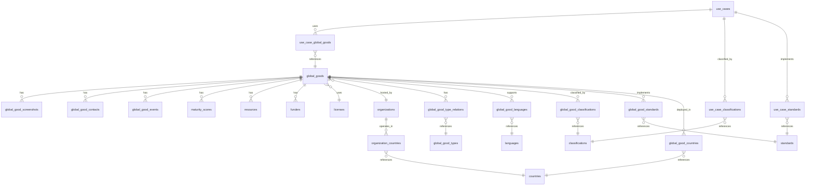

# Entity Relationship Diagram
## Global Goods Platform Database Structure

This document provides visual representations of the database relationships and data flow.

## Core Entity Relationships



## Data Structure Details

### Core Entities

#### global_goods
```
- id (UUID, Primary Key)
- slug (VARCHAR, Unique)
- name (VARCHAR)
- logo (VARCHAR) - Local file path
- summary (JSONB) - Multilingual
- description (JSONB) - Multilingual
- primary_functionality (JSONB) - Multilingual
- users (JSONB) - Multilingual
- inception_year (INTEGER)
- size_of_community (INTEGER)
- number_of_implementations (INTEGER)
- website_main (VARCHAR)
- website_docs (VARCHAR)
- website_source (VARCHAR)
- website_demo (VARCHAR)
- license_id (UUID, Foreign Key)
- community_description (JSONB) - Multilingual
- host_organization_id (UUID, Foreign Key)
- community_url (VARCHAR)
- mailing_list_url (VARCHAR)
- governance_url (VARCHAR)
- terms_of_use_url (VARCHAR)
- user_agreement_url (VARCHAR)
- privacy_policy_url (VARCHAR)
- do_no_harm_url (VARCHAR)
- pii_collected_url (VARCHAR)
- npii_used_url (VARCHAR)
- events_description (JSONB) - Multilingual
- events_schedule_url (VARCHAR)
- reach_summary (JSONB) - Multilingual
- maturity_summary (JSONB) - Multilingual
- climate_integration (JSONB) - Multilingual
- inclusive_design (JSONB) - Multilingual
- environmental_impact (JSONB) - Multilingual
- tco_description (JSONB) - Multilingual
- tco_url (VARCHAR)
- sustainability (JSONB) - Multilingual
- created_at (TIMESTAMP)
- updated_at (TIMESTAMP)
```

#### use_cases
```
- id (UUID, Primary Key)
- slug (VARCHAR, Unique)
- title (JSONB) - Multilingual
- purpose (JSONB) - Multilingual
- scope (JSONB) - Multilingual
- actors (JSONB) - Multilingual
- preconditions (JSONB) - Multilingual
- process_steps (JSONB) - Multilingual
- postconditions (JSONB) - Multilingual
- data_requirements (JSONB) - Multilingual
- technology_components (JSONB) - Multilingual
- challenges (JSONB) - Multilingual
- sustainability_considerations (JSONB) - Multilingual
- created_at (TIMESTAMP)
- updated_at (TIMESTAMP)
```

### Supporting Entities

#### global_good_events (Individual Records)
```
- id (UUID, Primary Key)
- global_good_id (UUID, Foreign Key)
- event_name (VARCHAR)
- event_date (DATE)
- description (JSONB) - Multilingual
- url (VARCHAR)
- created_at (TIMESTAMP)
```

#### maturity_scores (Multiple Sets Per Year)
```
- id (UUID, Primary Key)
- global_good_id (UUID, Foreign Key)
- year (INTEGER)
- global_utility (INTEGER 0-10)
- community_support (INTEGER 0-10)
- maturity_of_gg (INTEGER 0-10)
- inclusive_design (INTEGER 0-10)
- climate_resilience (INTEGER 0-10)
- low_carbon (INTEGER 0-10)
- entry_date (TIMESTAMP) - When score set was entered
- notes (JSONB) - Multilingual notes
- created_at (TIMESTAMP)
- UNIQUE(global_good_id, year, entry_date)
```

#### global_good_screenshots (Local File Storage)
```
- id (UUID, Primary Key)
- global_good_id (UUID, Foreign Key)
- filename (VARCHAR) - Local file path
- original_filename (VARCHAR)
- alt_text (JSONB) - Multilingual
- description (JSONB) - Multilingual
- sort_order (INTEGER)
- file_size (INTEGER)
- mime_type (VARCHAR)
- width (INTEGER)
- height (INTEGER)
- created_at (TIMESTAMP)
```

### Reference Data

#### countries (Flat Structure)
```
- id (UUID, Primary Key)
- iso_code (VARCHAR, Unique) - ISO 3166-1 alpha-3
- type (VARCHAR) - 'Country', 'Territory'
- names (JSONB) - {"en": {"short": "USA", "formal": "..."}, "fr": {...}, "es": {...}}
- created_at (TIMESTAMP)
- updated_at (TIMESTAMP)
```

#### classifications (Extensible Authorities)
```
- id (UUID, Primary Key)
- code (VARCHAR, Unique)
- title (JSONB) - Multilingual
- description (JSONB) - Multilingual
- authority (VARCHAR) - 'SDG', 'WHO', 'WMO', 'DPI' (extensible)
- group_code (VARCHAR)
- group_name (VARCHAR)
- created_at (TIMESTAMP)
- updated_at (TIMESTAMP)
```

## Junction Tables (Many-to-Many Relationships)

### Global Good Relationships
- `global_good_type_relations` - Global Good ↔ Types
- `global_good_languages` - Global Good ↔ Languages  
- `global_good_classifications` - Global Good ↔ Classifications
- `global_good_standards` - Global Good ↔ Standards (with category)
- `global_good_countries` - Global Good ↔ Implementation Countries

### Use Case Relationships
- `use_case_global_goods` - Use Case ↔ Global Goods
- `use_case_classifications` - Use Case ↔ Classifications
- `use_case_standards` - Use Case ↔ Standards

### Organization Relationships
- `organization_countries` - Organization ↔ Operating Countries

## Translation Strategy

### Multilingual Fields (JSONB)
All text content that needs translation is stored as JSONB:
```json
{
  "en": "English content",
  "fr": "Contenu français", 
  "es": "Contenido español"
}
```

### Fallback Strategy
1. Show content in user's selected language
2. If translation missing, fallback to English (en)
3. If English missing, show empty or placeholder

### Reference Data Translation
- All user-facing reference data has multilingual support
- Technical codes (ISO codes, etc.) remain untranslated
- Titles and descriptions are translated

## Search and Query Patterns

### Full-Text Search
- PostgreSQL full-text search on multilingual content
- Search across name, summary, and description fields
- Support for multiple languages simultaneously

### Filtering Patterns
- Filter by types, classifications, standards, countries
- Complex filter combinations supported
- Filter state preserved in URL parameters

### Performance Considerations
- Indexes on frequently queried fields
- Materialized views for complex aggregations
- Connection pooling for high-concurrency access

This entity relationship structure supports the complete Global Goods Platform with full multilingual capabilities, flexible classification systems, and comprehensive data relationships.